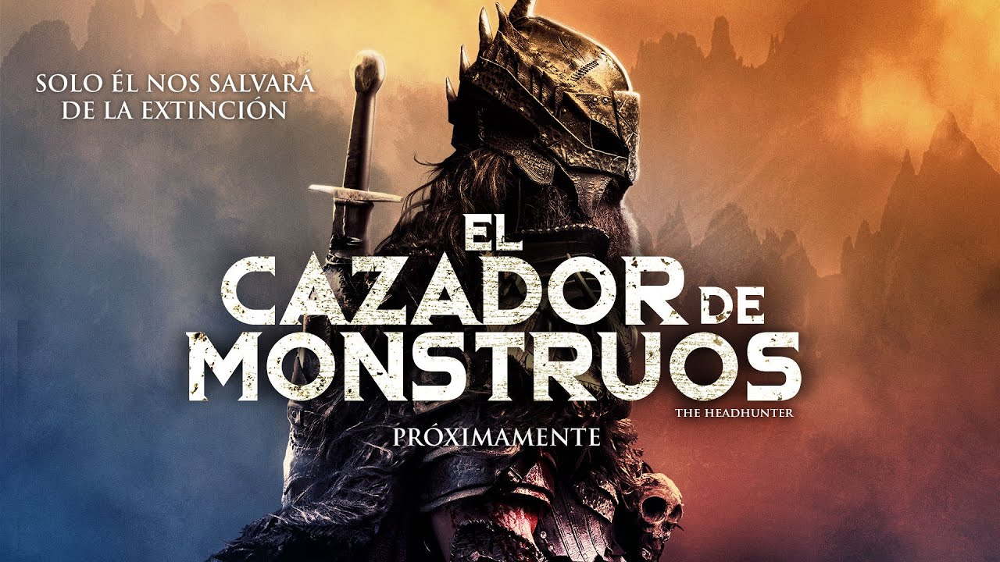

    
# **Monster Hunter v1**

Hecho por: Alejandro Tomas Pacheco Rodriguez

## Índice
- [Enunciado](#enunciado)
- [Codigo](#codigo)
- [Resultado](#resultado)

## **Enunciado** 

Para la version 1 del cazador de monstruos se pedia hacer un mapa que contenia cazadores y monstruos, los monstruos se quedaran estaticos mientras que los cazadores implementando el uso de la clase Thread se moveran por el mapa en busca de los monstruos. Ademas al ser el movimiento aleatorio sin inteligencia alguna se implementa un tiempo maximo de ejecución para evitar que se pueda ejecutar infinitamente.

## **Código** 

## **Resultado** 

